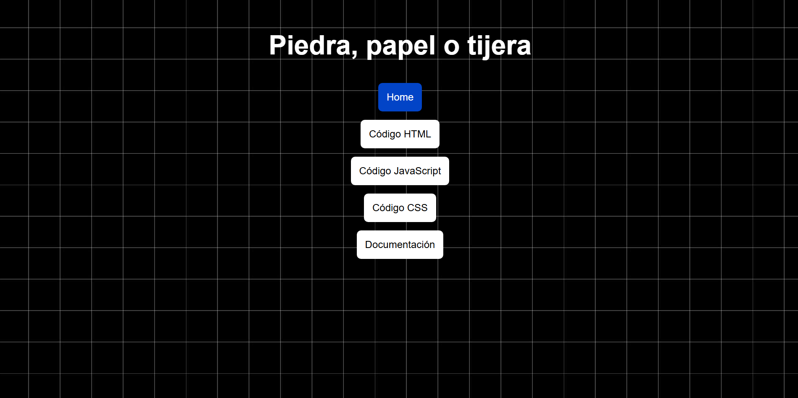
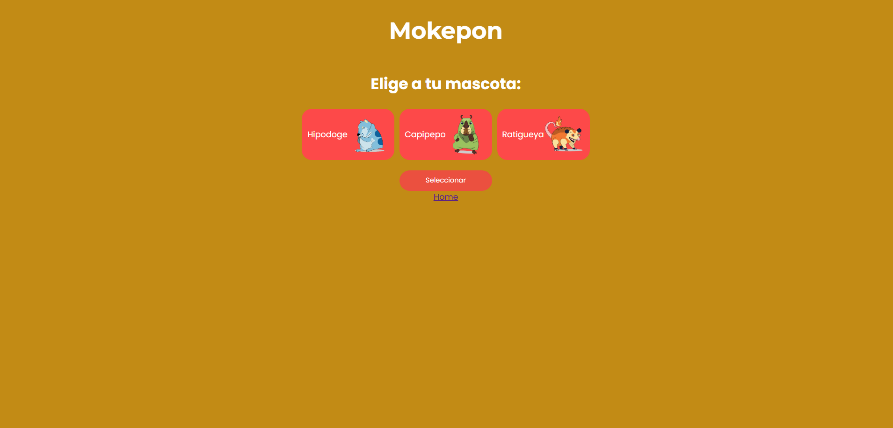

# Programación Básica

Este documento reúne mis apuntes técnicos y personales relacionados con Programación Básica, con el objetivo de documentar de forma estructurada los conceptos fundamentales y el proceso de aprendizaje asociado a su aplicación práctica.

Aqui se abordan temas como lógica de programación, estructuras de control, manipulación del DOM y fundamentos del desarrollo web utilizando JavaScript, HTML y CSS, aplicados en la construcción progresiva de un videojuego. Este repositorio funciona como material de referencia y evidencia de la consolidación de bases sólidas de programación.

Lecturas Recomendadas:

* Curso Programación Básica - Platzi: https://platzi.com/cursos/programacion-basica/

* Qué es Programación - freecodecamp: https://www.freecodecamp.org/espanol/news/que-es-programacion-manual-para-principiantes/

* Definición de Programación - Wikipedia: https://es.wikipedia.org/wiki/Programaci%C3%B3n

* HTML - MDN: https://developer.mozilla.org/es/docs/Web/HTML

* CSS - MDN: https://developer.mozilla.org/es/docs/Web/CSS

* JavaScript - MDN: https://developer.mozilla.org/es/docs/Web/JavaScript

*Imagen Tomada De: https://tenor.com/es-419/search/programador-gifs*

---

Si desea mirar **Piedra, Papel o Tijera** puede acceder a los siguentes vinculos (De este proyecto se encuentra la documentación desde el primer título hasta el título #15 del índice que se encuentra más abajo de este mismo documento. Siendo asi: Los Fundamentos de Programación)

* [Proyecto](https://santiagoencodigo.github.io/Desarrollo-Web-Profesional/pages/04-programacion-basica/01-piedra-papel-o-tijera/piedra-papel-o-tijera.html "Proyecto - Piedra Papel o Tijera")

* [Código HTML](https://github.com/santiagoencodigo/Desarrollo-Web-Profesional/blob/main/pages/04-programacion-basica/01-piedra-papel-o-tijera/piedra-papel-o-tijera.html "Código HTML - Piedra Papel o Tijera")

* [Código JavaScript](https://github.com/santiagoencodigo/Desarrollo-Web-Profesional/blob/main/pages/04-programacion-basica/01-piedra-papel-o-tijera/piedra-papel-o-tijera.js "Código JS - Piedra Papel o Tijera")

---

Si desea mirar **Mokepon** puede acceder a los siguentes vinculos (Este se empieza a documentar desde el título #16. Maquetación de Páginas Web para Videojuegos en HTML):

* [Proyecto](https://santiagoencodigo.github.io/Desarrollo-Web-Profesional/pages/04-programacion-basica/02-mokepon/mokepon.html "Mokepon - Demo en vivo by Santiagoencodigo")

* [Código HTML](https://github.com/santiagoencodigo/Desarrollo-Web-Profesional/blob/main/pages/04-programacion-basica/02-mokepon/mokepon.html)

* [Código JavaScript](https://github.com/santiagoencodigo/Desarrollo-Web-Profesional/blob/main/pages/04-programacion-basica/02-mokepon/js/mokepon.js)

* [Código CSS](https://github.com/santiagoencodigo/Desarrollo-Web-Profesional/blob/main/pages/04-programacion-basica/02-mokepon/mokepon.css)

---

## Tabla de Contenido

### Fundamentos de Programación

* [1. Programación Básica: Fundamentos y Creación de Proyectos en Línea](#programación-básica-fundamentos-y-creación-de-proyectos-en-línea)

* [2. Programación Básica en Google Chrome: Variables y Funciones](#programación-básica-en-google-chrome-variables-y-funciones)

* [3. Creación de una Página Web Básica con HTML](#creación-de-una-página-web-básica-con-html)

* [4. Estructuras Básica de un Documento HTML](#estructuras-básica-de-un-documento-html)

* [5. Estructura y funcionamiento básico de HTML y JavaScript](#estructura-y-funcionamiento-básico-de-html-y-javascript)

* [6. Instalación y uso básico de Visual Studio Code para programar](#instalación-y-uso-básico-de-visual-studio-code-para-programar)

* [7. Declaración y Uso Básico de Variables en JavaScript](#declaración-y-uso-básico-de-variables-en-javascript)

* [8. Programación de Piedra, Papel o Tijera en JavaScript](#programación-de-piedra-papel-o-tijera-en-javascript)

* [9. Algoritmo Avanzado de Piedra, Papel o Tijera en JavaScript](#algoritmo-avanzado-de-piedra-papel-o-tijera-en-javascript)

* [10. Generación de Números Aleatorios con JavaScript](#generación-de-números-aleatorios-con-javascript)

* [11. Creación y uso de funciones en programación](#creación-y-uso-de-funciones-en-programación)

* [12. Ciclos y Condiciones en Programación: Piedra, Papel o Tijera](#ciclos-y-condiciones-en-programación-piedra-papel-o-tijera)

* [13. Programación de Piedra, Papel o Tijera en JS: Ciclos - Gana 3 Veces](#programación-de-piedra-papel-o-tijera-en-js-ciclos---gana-3-veces)

* [14. Manejo de Rutas y Archivos en Sistemas Operativos y Desarrollo Web](#manejo-de-rutas-y-archivos-en-sistemas-operativos-y-desarrollo-web)

* [15. Manipulación del DOM y Eventos en JavaScript para Juegos Web](#manipulación-del-dom-y-eventos-en-javascript-para-juegos-web)

### Desarrollando un juego con HTML y JavaScript

* [16. Maquetación de Páginas Web para Videojuegos en HTML](#maquetación-de-páginas-web-para-videojuegos-en-html)

* [17. Selección de Mascotas en HTML para Juegos Interactivos](#selección-de-mascotas-en-html-para-juegos-interactivos)

* [18. Programar eventos de click en botones HTML con JavaScript](#programar-eventos-de-click-en-botones-html-con-javascript)

* [19. Eventos de Carga en JavaScript: Iniciar Juego y Seleccionar Mascota](#eventos-de-carga-en-javascript-iniciar-juego-y-seleccionar-mascota)

* [20. Selección de Mascota en JavaScript: Implementación y Validación](#selección-de-mascota-en-javascript-implementación-y-validación)

* [21. Manipulación del DOM con JavaScript para mostrar mascota seleccionada](#manipulación-del-dom-con-javascript-para-mostrar-mascota-seleccionada)

* [22. Selección Aleatoria de Mascota Enemiga en JavaScript](#selección-aleatoria-de-mascota-enemiga-en-javascript)

* [23. Eventos de clic y lógica de ataque en JavaScript](#eventos-de-clic-y-lógica-de-ataque-en-javascript)

* [24. Ataques Aleatorios para Mascotas Enemigas en JavaScript](#ataques-aleatorios-para-mascotas-enemigas-en-javascript)

* [25. Creación de Mensajes Dinámicos en Combate HTML y JavaScript](#creación-de-mensajes-dinámicos-en-combate-html-y-javascript)

* [26. Lógica de Combate en JavaScript para juego Mokepon](#lógica-de-combate-en-javascript-para-juego-mokepon)

# Fundamentos de Programación

## Programación Básica: Fundamentos y Creación de Proyectos en Línea

Eventualmente estaremos viendo los principios esenciales de la programación y su aplicación en la creación de proyectos interactivos para la web. A lo largo del desarrollo se van a trabajar conceptos clave como la lógica de programación, la estructuración del código y la optimización de soluciones, utilizando HTML, JavaScript y CSS como tecnologías base.
El enfoque práctico se materializa en la construcción progresiva de un videojuego, integrando estilos visuales con CSS, renderizado y manejo de gráficos mediante Canvas, y una introducción a componentes de backend orientados a experiencias multijugador. Este conjunto de contenidos permite comprender el ciclo completo de desarrollo de un proyecto web, desde la lógica y la interfaz hasta la interacción en tiempo real.

---

## Programación Básica en Google Chrome: Variables y Funciones

Google Chrome como entorno de exploración y aprendizaje, se puede hacer uso directo de las herramientas de desarrollo y, en particular, de la consola del navegador. Al acceder a una página en blanco mediante **about:blank** y abrir el panel de inspección, es posible ejecutar instrucciones de JavaScript en tiempo real, lo que permite comprender de forma práctica cómo el navegador interpreta y ejecuta código.

*Imagen Tomada De: https://platzi.com/cursos/programacion-basica/51978-como-aprender-programacion/*

**Lecturas Recomendadas:**

* Developer Tools - AWS: https://aws.amazon.com/es/what-is/developer-tools/

* Developer Tools - MDN: https://developer.mozilla.org/es/docs/Learn_web_development/Howto/Tools_and_setup/What_are_browser_developer_tools

* DevTools - Chrome: https://developer.chrome.com/docs/devtools?hl=es-419

Video Recomendado: Paso a Paso Devtools Chrome TUTORIAL by Studios Johan: https://www.youtube.com/watch?v=b1n2UnSe1uM

* about:blank - freecodecamp: https://www.freecodecamp.org/espanol/news/about-blank-que-significa-y-deberias-deshacerte-de-el/

* about:blank - avast: https://www.avast.com/es-es/c-what-is-about-blank-and-is-it-safe

El navegador funciona como un entorno de ejecución que, al acceder a un dominio, solicita a un servidor los recursos necesarios para construir la aplicación: el DOM (Document Object Model), el CSSOM (CSS Object Model) y el JSOM (entorno de ejecución de JavaScript). Esto implica que, al navegar por la web, se está ejecutando constantemente código escrito por terceros, lo cual refuerza la importancia de comprender cómo se estructuran y ejecutan estas tecnologías.

*Imagen Tomada De: https://web.dev/articles/critical-rendering-path/render-tree-construction?hl=es-419*

**Lecturas Recomendadas:**

* Qué es el DOM - Freecodecamp: https://www.freecodecamp.org/espanol/news/que-es-el-dom-el-significado-del-modelo-de-objeto-de-documento-en-javascript/

* Render Tree - web.dev: https://web.dev/articles/critical-rendering-path/render-tree-construction?hl=es-419

A través de la consola se pueden explorar conceptos como la declaración y asignación de variables, el uso de operaciones matemáticas, y la ejecución de funciones integradas del lenguaje, como alert() o prompt(). Estas funciones deben ser escritas con exactitud sintáctica, respetando el uso de minúsculas y la estructura correcta de paréntesis, ya que la programación exige precisión absoluta y no admite ambigüedades en su interpretación.

**Lecturas Recomendadas:**

* Variable (Programación) - Wikipedia: https://es.wikipedia.org/wiki/Variable_(programaci%C3%B3n)

* Variable (Matemáticas) - Wikipedia: https://es.wikipedia.org/wiki/Variable_(matem%C3%A1tica)

* alert(" ") - MDN: https://developer.mozilla.org/es/docs/Web/API/Window/alert

---

Función: Es un bloque de código diseñado para ejecutar una tarea específica

Invocar una función en JavaScript: Ejecutar su lógica mediante el uso de paréntesis.

Parámetro: como el valor que una función recibe para modificar su comportamiento o resultado.

---

Programar consiste en definir un conjunto de instrucciones claras, ordenadas y finitas para resolver un problema específico. A nivel algorítmico, este proceso implica analizar el problema, establecer una lógica de solución y traducirla a un lenguaje que la computadora pueda interpretar y ejecutar.

En programación, el orden de los factores puede alterar el resultado de una operación dependiendo del tipo de cálculo que se realice. Las operaciones matemáticas y lógicas siguen reglas estrictas de precedencia, por lo que respetar el orden correcto es fundamental para garantizar resultados precisos y evitar errores en la ejecución del código.

Antes de los lenguajes de programación modernos, la programación se realizaba mediante sistemas físicos como las tarjetas perforadas. Estas tarjetas contenían instrucciones representadas por perforaciones y eran procesadas por máquinas para ejecutar tareas específicas, sentando las bases de la programación estructurada actual.

*Imagen Tomada De: https://es.wikipedia.org/wiki/Tarjeta_perforada*

La memoria RAM es el espacio donde se almacenan temporalmente los datos que un programa necesita mientras se está ejecutando. Cuando se declara una variable, el sistema asigna un espacio en memoria para guardar su valor, permitiendo que este sea accedido, modificado o eliminado durante la ejecución del programa.

Un string es un tipo de dato utilizado para representar texto. Está compuesto por una secuencia de caracteres y se define comúnmente entre comillas. Los strings se emplean para manejar información textual como mensajes, nombres, valores de entrada del usuario y contenido dinámico dentro de una aplicación.

**Lecturas Recomendadas:**

* https://developer.mozilla.org/es/docs/Glossary/String

* https://www.freecodecamp.org/espanol/news/que-es-una-cadena-de-caracteres-string-en-javascript/

*Imagen Tomada De: https://platzi.com/cursos/programacion-basica/51978-como-aprender-programacion/*

---

## Creación de una Página Web Básica con HTML

Un archivo de programación es un documento de texto que contiene instrucciones escritas en un lenguaje específico y que pueden ser interpretadas por un sistema o entorno de ejecución. En desarrollo web, estos archivos permiten definir estructura, estilos y comportamiento de una página.

El sistema de archivos es el método que utiliza un sistema operativo para organizar, almacenar y recuperar archivos en un dispositivo. Define cómo se estructuran las carpetas, cómo se nombran los archivos y cómo se accede a ellos.

Una carpeta es un contenedor utilizado para organizar archivos dentro de un sistema. Su función principal es mantener una estructura ordenada que facilite la administración, localización y mantenimiento de los archivos de un proyecto.

Todo archivo posee un nombre y una extensión, separadas por un punto (.). La extensión indica el tipo de contenido del archivo y le permite al sistema operativo y a las aplicaciones saber cómo debe ser interpretado o ejecutado.

*Imagen Tomada De: https://es.wikipedia.org/wiki/Archivo_(inform%C3%A1tica)* 

En dispositivos móviles como Android, las extensiones de archivo suelen estar ocultas al usuario. En sistemas operativos como Windows y macOS, estas extensiones pueden mostrarse activando una opción del sistema, aunque por defecto no siempre están visibles.

* Un archivo DOCX es un documento de texto utilizado principalmente para la creación y edición de contenido escrito. Es comúnmente empleado para informes, cartas y documentación, y es interpretado por procesadores de texto.

* Un archivo XLS es un documento orientado al manejo de datos tabulares y cálculos. Se utiliza para organizar información en filas y columnas, realizar operaciones matemáticas y analizar datos.

Lectura Recomendada:

Resumen sobre las Extensiones de Archivos - IONOS: https://www.ionos.com/es-us/digitalguide/servidores/know-how/resumen-de-las-extensiones-de-archivos/

---

Un archivo HTML es un documento de texto que define la estructura de una página web. Contiene etiquetas que indican al navegador cómo debe organizar y mostrar el contenido.

*Imagen Tomada De: https://lenguajehtml.com/html/documento/estructura-documento-html/*

HTML es fundamental para el funcionamiento de Internet, ya que es el lenguaje base con el que se construyen las páginas web. Sin HTML, los navegadores no tendrían una forma estándar de interpretar y presentar información al usuario.

Lectura Recomendada: 

La web y los estándares web - MDN: https://developer.mozilla.org/es/docs/Learn_web_development/Getting_started/Web_standards/The_web_standards_model

CSS es un lenguaje de estilos utilizado para definir la apariencia visual de una página web. Se considera una declaración de diseño porque especifica cómo deben mostrarse los elementos HTML en términos de colores, tamaños, posiciones y estilos.

El código CSS puede escribirse directamente dentro de un archivo HTML o incluirse como un documento externo. Separar los estilos en archivos independientes mejora la organización, el mantenimiento y la reutilización del diseño.

*Imagen Tomada De: https://es.wikipedia.org/wiki/CSS*

JavaScript es un lenguaje de programación que permite agregar interactividad y comportamiento dinámico a las páginas web. Con JavaScript se pueden manejar eventos, modificar el contenido, validar datos y comunicarse con servidores.

*Imagen Tomada De: https://es.wikipedia.org/wiki/JavaScript*

HTML se encarga de definir la estructura de una página web, estableciendo qué elementos existen y cómo se organizan. Actúa como el esqueleto sobre el cual se aplican estilos y funcionalidades.

Al crear un archivo HTML se establecen los primeros elementos de una página web. Este archivo representa el punto inicial desde el cual se construye toda la estructura visual y funcional del sitio.

> Todos los archivos son, en esencia, texto. La diferencia entre ellos radica en la forma en que ese texto está organizado y en las reglas que determinan cómo debe ser interpretado por distintos programas.

Es posible escribir código utilizando editores de texto simples como el bloc de notas. Sin embargo, los editores de código especializados ofrecen ayudas visuales, resaltado de sintaxis y herramientas que facilitan la escritura, lectura y mantenimiento del código.

Video Recomendado - Cómo hacer Código HTML en Bloc de Notas by divcode: https://www.youtube.com/watch?v=irigISsaHqs

La etiqueta <strong></strong> se utiliza para resaltar texto con un énfasis semántico importante. Indica que el contenido tiene mayor relevancia dentro del contexto de la página.

La etiqueta <h1></h1> representa el encabezado principal de una página web. Se utiliza para definir el título más importante del contenido y cumple un papel clave en la estructura y accesibilidad del documento.

**Lecturas Recomendadas:**

* Etiqueta Strong en HTML - MDN: https://developer.mozilla.org/es/docs/Web/HTML/Reference/Elements/strong

* Etiquetas Headers/Títulos en HTML - MDN: https://developer.mozilla.org/es/docs/Web/HTML/Reference/Elements/Heading_Elements

*Imagen Tomada De: https://platzi.com/cursos/html-css-2020/que-vas-a-aprender-en-este-curso/*

---

## Estructuras Básica de un Documento HTML

Los sitios web se cargan de forma secuencial, lo que significa que el navegador procesa el código siguiendo el orden en el que aparece en el archivo. Este comportamiento influye directamente en la forma en que se renderiza el contenido.

**Lectura Recomendada:**

Cómo funciona la web - MDN: https://developer.mozilla.org/es/docs/Learn_web_development/Getting_started/Web_standards/How_the_web_works

Las computadoras procesan instrucciones a velocidades muy altas, medidas en hertz. El navegador interpreta el código HTML de arriba hacia abajo y ejecuta cada instrucción rápidamente, haciendo que el proceso de carga no sea perceptible para el usuario.

Un documento HTML sigue una estructura definida que permite al navegador interpretar correctamente su contenido. Esta estructura establece el orden y la jerarquía de los elementos que conforman una página web.

**Lectura Recomendada:**

Cómo los navegadores cargan los sitios web - MDN: https://developer.mozilla.org/es/docs/Learn_web_development/Getting_started/Web_standards/How_browsers_load_websites

HTML funciona como un árbol jerárquico, donde cada elemento puede contener otros elementos dentro de sí. Esta organización permite representar relaciones entre los distintos componentes de la página y facilita su manipulación mediante estilos y scripts.

En HTML, una etiqueta contenedora agrupa otros elementos dentro de ella, funcionando de manera similar a una caja que contiene otras cajas. Esta estructura permite organizar el contenido de forma lógica y jerárquica dentro del documento.

La etiqueta **html** envuelve todo el contenido del documento y define el inicio y fin de una página web. Es el elemento raíz del árbol HTML y contiene tanto la sección de configuración como el contenido visible.

* https://developer.mozilla.org/es/docs/Web/HTML/Reference/Elements/html

La etiqueta **head** contiene información descriptiva y de configuración del documento. El contenido ubicado en esta sección no es visible para el usuario, pero es esencial para el funcionamiento, presentación y comportamiento de la página.

* https://developer.mozilla.org/es/docs/Web/HTML/Reference/Elements/head

La etiqueta **title** define el título del documento, el cual se muestra en la pestaña del navegador. Este elemento es importante para la identificación de la página y su correcta indexación.

* https://developer.mozilla.org/es/docs/Web/HTML/Reference/Elements/title

La etiqueta **body** contiene todos los elementos visibles de la página web. Dentro de esta sección se incluyen textos, imágenes, enlaces y cualquier otro componente que interactúe directamente con el usuario.

* https://developer.mozilla.org/es/docs/Web/HTML/Reference/Elements/body

*Imagen Tomada De: https://es.wikipedia.org/wiki/HTML*

---

El uso eficiente de atajos de teclado es una práctica común entre programadores experimentados. Estos atajos permiten aumentar la productividad y reducir el tiempo dedicado a tareas repetitivas.

**Lecturas Recomendadas:**

* https://es.wikipedia.org/wiki/Atajo_de_teclado

* https://www.esedsl.com/blog/100-atajos-teclado-windows-mac

El atajo Ctrl + S permite guardar un documento de forma inmediata desde el teclado. Este comando es fundamental para preservar cambios realizados durante el desarrollo.

El atajo Ctrl + R se utiliza para recargar una página web en el navegador. Este comando permite visualizar los cambios realizados en el código sin necesidad de usar el mouse.

*Imagen Tomada De: https://cl.pinterest.com/pin/739997782547460343/*

---

## Estructura y funcionamiento básico de HTML y JavaScript

Un documento HTML está compuesto por una estructura definida que permite al navegador interpretar y renderizar correctamente el contenido. Esta estructura establece la organización general de los elementos que conforman una página web.

*Imagen Tomada De: https://disenowebakus.net/domine-html-y-dhtml-primeros-pasos.php*

HTML se organiza como un árbol jerárquico de etiquetas. En esta estructura, **html** actúa como la raíz principal, dentro de la cual se encuentran **head** y body. A su vez, **head** puede contener elementos como **title**, mientras que **body** incluye etiquetas visibles como **h1** y **p**, formando una jerarquía clara y ordenada.

Dentro de la etiqueta **head** puede incluirse la etiqueta **script**, la cual se utiliza para cargar código escrito en JavaScript. Este código puede integrarse directamente en el documento HTML o referenciarse desde un archivo externo, permitiendo separar la lógica de programación de la estructura del contenido.

**Lecturas Recomendadas:**

* etiqueta html by MDN: https://developer.mozilla.org/es/docs/Web/HTML/Reference/Elements/html

* etiqueta head by MDN: https://developer.mozilla.org/es/docs/Web/HTML/Reference/Elements/head

* etiqueta title by MDN: https://developer.mozilla.org/es/docs/Web/HTML/Reference/Elements/title

* etiqueta script by MDN: https://developer.mozilla.org/es/docs/Web/HTML/Reference/Elements/script

* etiqueta body by MDN: https://developer.mozilla.org/es/docs/Web/HTML/Reference/Elements/body

* etiqueta header by MDN: https://developer.mozilla.org/es/docs/Web/HTML/Reference/Elements/header

* etiqueta p by MDN: https://developer.mozilla.org/es/docs/Web/HTML/Reference/Elements/p

La indentación mediante la tecla TAB se utiliza para organizar visualmente el código y facilitar su lectura. Aunque no es obligatoria en HTML, JavaScript o CSS, se considera una buena práctica. En lenguajes como Python, la indentación sí es obligatoria para el correcto funcionamiento del código.

*Imagen Tomada De: https://medium.com/@sthefany/qu%C3%A9-es-la-indentaci%C3%B3n-c9471f3ae84f*

**Lectura Recomendada:**

* Identación python by freecodecamp: https://www.freecodecamp.org/espanol/news/indentacion-en-python-con-ejemplos/

En JavaScript, la forma en que se evalúan las expresiones depende del tipo de datos involucrados. Cuando se utiliza la expresión **alert("El valor de a+b es " + a + b)**, los valores se concatenan como texto, produciendo el resultado 12, ya que los valores numéricos se interpretan como strings al combinarse con texto.

Al agregar paréntesis en una operación, como en **alert("El valor de a+b es " + (a + b))**, JavaScript evalúa primero la suma de los valores numéricos. Esto permite obtener el resultado matemático correcto antes de concatenarlo con el texto.

**Lectura Recomendada:**

* Expresiones y Operadores en Javascript by Freecodecamp: https://developer.mozilla.org/es/docs/Web/JavaScript/Guide/Expressions_and_operators

En JavaScript, los espacios entre variables y operadores no afectan la ejecución del código. Expresiones como **a+b** y **a + b** son interpretadas de la misma manera por el lenguaje, lo que permite flexibilidad en la escritura sin afectar el resultado.

*Imagen Tomada De: https://app.aluracursos.com/forum/topico-string-y-entero-javascript-concatenacion-108481*

---

Las variables pueden almacenar distintos tipos de valores. Entre los más comunes se encuentran los valores numéricos, utilizados para operaciones matemáticas, y los valores textuales, empleados para representar cadenas de caracteres.

Lecturas Recomendadas:

* Gramática y tipos en Javascript by MDN: https://developer.mozilla.org/es/docs/Web/JavaScript/Guide/Grammar_and_types

* Variables de Javascript by w3schools: https://www.w3schools.com/js/js_variables.asp

Video Recomendado - JavaScript - Variables - W3Schools.com: https://www.youtube.com/watch?v=7xStNKTM3bE&list=PLP9IO4UYNF0WWmZpE3W33vVPRl2GvjEqz

La concatenación es el proceso mediante el cual se unen valores, generalmente strings, para formar una sola cadena de texto. En JavaScript, este proceso se realiza comúnmente utilizando el operador +.

Es posible escribir código utilizando editores de texto simples como el bloc de notas. Sin embargo, existen herramientas especializadas como [Visual Studio Code](https://code.visualstudio.com/ "code.visualstudio.com/") o [Cursor](https://cursor.com/ "cursor.com"), que ofrecen funcionalidades adicionales como resaltado de sintaxis, autocompletado y herramientas de depuración que mejoran la experiencia de desarrollo.

*Imagen Tomada De: https://www.youtube.com/watch?v=H7LwUj2zlhA*

---

## Instalación y uso básico de Visual Studio Code para programar

Un editor de código es una herramienta diseñada para escribir y mantener código fuente de manera eficiente. Existen múltiples opciones como [Visual Studio Code](https://code.visualstudio.com/ "https://code.visualstudio.com/"), [Sublime Text](https://www.sublimetext.com/ "https://www.sublimetext.com/") y [Notepad++](https://notepad-plus-plus.org/ "https://notepad-plus-plus.org/"), cada una con características orientadas al desarrollo de software.

**Lecturas Recomendadas:**

* Editor vs IDE by EDTeam: https://ed.team/blog/editor-vs-ide-que-usar-para-programar

* Editor de Código Fuente by Wikipedia: https://es.wikipedia.org/wiki/Editor_de_c%C3%B3digo_fuente

* Editores de Código by MDN: https://developer.mozilla.org/es/docs/Learn_web_development/Getting_started/Environment_setup/Code_editors

Aplicaciones de redacción de texto como Microsoft Word no son adecuadas para programar, ya que modifican el contenido con formato invisible y no respetan la sintaxis ni la estructura requerida por los lenguajes de programación.

Los editores de código identifican distintos elementos del lenguaje y los muestran con colores específicos para facilitar la lectura y comprensión. Estas ayudas visuales no afectan el funcionamiento del código y pueden variar entre editores.

Visual Studio Code es un editor de código multiplataforma que permite escribir, ejecutar y depurar programas. Su instalación es sencilla y, una vez configurado, ofrece herramientas como resaltado de sintaxis, gestión de archivos y extensiones que mejoran la productividad.

*Imagen Tomada De: https://kinsta.com/es/blog/editores-html-gratuitos/*

Existen diferentes editores y entornos de desarrollo que cumplen funciones similares. La elección del editor depende de las preferencias del desarrollador, ya que todos permiten trabajar con los mismos archivos de código.

El sistema operativo no condiciona el proceso de programación, ya que el código fuente es texto. Un mismo archivo puede ser creado y ejecutado en distintos sistemas siempre que se utilicen las herramientas adecuadas.

La extensión de un archivo indica al editor y al sistema cómo debe interpretarse su contenido. Usar la extensión correcta es fundamental para que el editor reconozca el lenguaje y aplique las reglas de sintaxis correspondientes.

Las carpetas permiten estructurar y organizar los archivos de un proyecto. Una correcta organización facilita el mantenimiento, la navegación y la comprensión del código.

El PATH es una variable del sistema que indica dónde buscar programas ejecutables. Su correcta configuración permite que la terminal y editores como Visual Studio Code ejecuten comandos y herramientas desde la línea de comandos sin especificar rutas completas.

Visual Studio Code utiliza colores para diferenciar elementos del código, como etiquetas HTML, símbolos y texto. Estos colores son arbitrarios y no forman parte del código en sí; su función es servir como apoyo visual para el desarrollador.

Los errores en el código suelen resaltarse en color rojo dentro del editor. Esta funcionalidad permite identificar problemas de sintaxis o estructura de forma rápida durante el desarrollo.

*Imagen Tomada De: https://marketplace.visualstudio.com/items?itemName=usernamehw.errorlens*

---

La etiqueta **charset** define la codificación de caracteres utilizada en un documento HTML. Permite al navegador interpretar correctamente el texto contenido en la página.

UTF-8 es un estándar de codificación de caracteres ampliamente utilizado en la web. Permite representar una gran variedad de símbolos y alfabetos, garantizando compatibilidad entre distintos sistemas y navegadores.

Los atributos son propiedades adicionales que se asignan a las etiquetas HTML para modificar su comportamiento o proporcionar información extra. Se escriben dentro de la etiqueta de apertura y siguen una estructura clave-valor.

**Lecturas Recomendadas:**

* Contenido de Metadatos by MDN: https://developer.mozilla.org/es/docs/Learn_web_development/Core/Structuring_content/Webpage_metadata

* Atributos en HTML: https://developer.mozilla.org/es/docs/Web/HTML/Reference/Attributes

---

## Declaración y Uso Básico de Variables en JavaScript

En JavaScript, una variable se declara utilizando la palabra clave let. Esta instrucción permite crear un espacio en memoria donde se almacenará un valor que puede cambiar durante la ejecución del programa.

**Lecturas Recomendadas:**

* Let en JS by MDN: https://developer.mozilla.org/es/docs/Web/JavaScript/Reference/Statements/let

* Let en JS by w3schools: https://www.w3schools.com/js/js_let.asp

* Diferencias entre var, let y const en JS by freecodecamp: https://www.freecodecamp.org/espanol/news/var-let-y-const-cual-es-la-diferencia/

* Cómo se declara una variable by EDteam: https://ed.team/blog/que-es-y-como-se-declara-una-variable

Al declarar una variable, el sistema asigna un espacio en la memoria RAM para almacenar su valor. Este almacenamiento es temporal y existe únicamente mientras el programa se encuentra en ejecución.

Una variable es un contenedor que almacena datos para ser utilizados posteriormente en el código. Permite guardar información, reutilizarla y modificarla según la lógica del programa.

El signo = se utiliza para asignar un valor a una variable. No representa una comparación, sino una instrucción que indica que el valor ubicado a la derecha debe almacenarse en la variable definida a la izquierda.

Las comillas dobles (" ") se utilizan para definir cadenas de texto en JavaScript. Todo valor contenido dentro de comillas es interpretado como texto y no como un valor numérico o una expresión lógica.

**Lectura Recomendada:**

* Strings en JS by MDN: https://developer.mozilla.org/es/docs/Learn_web_development/Core/Scripting/Strings

*Imagen Tomada De:  https://www.apinem.com/variables-en-javascript/*

prompt es una función integrada de JavaScript que permite solicitar información al usuario mediante una ventana emergente. El valor ingresado por el usuario es devuelto al programa para su posterior uso.

**Lectura Recomendada:**

* Prompt en JS by MDN: https://developer.mozilla.org/es/docs/Web/API/Window/prompt

El valor retornado por la función prompt puede ser asignado a una variable. Esto permite almacenar la información ingresada por el usuario y utilizarla dentro de la lógica del programa.

Por defecto, los valores obtenidos mediante prompt son tratados como cadenas de texto. Para realizar operaciones numéricas, es necesario convertir explícitamente estos valores a tipos numéricos, ya que trabajar con datos sin validar o convertir correctamente puede generar errores lógicos y representar un riesgo de seguridad.

Lectura Recomendada: 

* parseINT en JS by MDN: https://developer.mozilla.org/es/docs/Web/JavaScript/Reference/Global_Objects/parseInt

---

## Programación de Piedra, Papel o Tijera en JavaScript

Si quiere ver el trabajo de esta sección puede acceder a los siguentes vinculos:

* [Proyecto](https://santiagoencodigo.github.io/Desarrollo-Web-Profesional/pages/04-programacion-basica/01-piedra-papel-o-tijera/piedra-papel-o-tijera.html "Proyecto - Piedra Papel o Tijera")

* [Código HTML](https://github.com/santiagoencodigo/Desarrollo-Web-Profesional/blob/main/pages/04-programacion-basica/01-piedra-papel-o-tijera/piedra-papel-o-tijera.html "Código HTML - Piedra Papel o Tijera")

* [Código JavaScript](https://github.com/santiagoencodigo/Desarrollo-Web-Profesional/blob/main/pages/04-programacion-basica/01-piedra-papel-o-tijera/piedra-papel-o-tijera.js "Código JS - Piedra Papel o Tijera")

Piedra, Papel o Tijera es un juego basado en reglas circulares donde cada opción vence a una y pierde contra otra. Tijera corta papel, papel envuelve piedra y piedra rompe tijera, lo que permite establecer condiciones lógicas para determinar un resultado.

*Imagen Tomada De: https://es.wikipedia.org/wiki/Piedra,_papel_o_tijera*

La programación de Piedra, Papel o Tijera consiste en traducir las reglas del juego a instrucciones lógicas que permitan comparar elecciones y tomar decisiones de forma automática mediante condicionales.

Para simplificar la lógica, cada opción del juego se representa con un valor numérico. Por ejemplo, 1 para piedra, 2 para papel y 3 para tijera, facilitando la comparación dentro del código.

Para ejecutar el juego, se crea un documento HTML con su estructura básica, utilizando las etiquetas html, head y body, lo que permite integrar contenido y lógica de programación en una página web.

**Lectura Recomendada:** [Estructura Básica de un Documento HTML](#estructuras-básica-de-un-documento-html)

La etiqueta !DOCTYPE html indica al navegador que el documento utiliza el estándar HTML5. Su uso garantiza una correcta interpretación del código y compatibilidad con los navegadores modernos.

**Lecturas Recomendadas:**

* Definición de DOCTYPE html by MDN: https://developer.mozilla.org/es/docs/Glossary/Doctype

* ¿Qué es la declaración DOCTYPE en HTML by freecodecamp: https://www.freecodecamp.org/espanol/news/que-es-la-declaracion-en-html/

La etiqueta script permite incluir código JavaScript dentro de un documento HTML. A través de esta etiqueta se define la lógica que controla el comportamiento del juego.

* https://developer.mozilla.org/es/docs/Web/HTML/Reference/Elements/script

Se utilizan variables como let jugador y let pc para almacenar las elecciones realizadas por el usuario y la computadora. Estas variables permiten gestionar los datos necesarios para evaluar el resultado del juego.

* https://developer.mozilla.org/es/docs/Web/JavaScript/Reference/Statements/let

El operador = se utiliza para asignar un valor a una variable, mientras que == se emplea para comparar dos valores dentro de una condición. Confundir estos operadores puede generar errores lógicos en el programa.

* https://developer.mozilla.org/es/docs/Web/JavaScript/Guide/Expressions_and_operators#asignacion

* https://developer.mozilla.org/es/docs/Web/JavaScript/Guide/Expressions_and_operators#comparacion

Un comentario es una línea de texto que no es ejecutada por el programa. Su función es documentar el código y facilitar su comprensión. En JavaScript, los comentarios se escriben utilizando //.

* https://developer.mozilla.org/es/docs/Web/JavaScript/Reference/Lexical_grammar

*Imagen Tomada De: https://www.youtube.com/watch?v=8cu8YQmJeys*

---

La opción Word Wrap permite ajustar visualmente las líneas largas de código para que se adapten al ancho del editor. Esta herramienta mejora la legibilidad sin modificar el contenido del archivo.

* Documentación VS CODE - Word Wrap: https://learn.microsoft.com/es-es/visualstudio/ide/reference/how-to-manage-word-wrap-in-the-editor?view=visualstudio

* Video Recomendado: https://www.youtube.com/watch?v=Pg8iVar_-0M

*Imagen Tomada De: https://stackoverflow.com/questions/31025502/how-can-i-switch-word-wrap-on-and-off-in-visual-studio-code*

---

La función prompt se utiliza para solicitar al jugador que elija una opción. El valor ingresado se almacena en la variable jugador, permitiendo registrar la decisión del usuario.

* https://developer.mozilla.org/es/docs/Web/API/Window/prompt

La concatenación permite unir texto con el valor de una variable. En la expresión alert("Elegiste " + jugador), se combina un string con el valor almacenado en la variable para mostrar un mensaje comprensible al usuario.

El espacio incluido dentro del string "Elegiste " es necesario para **separar visualmente el texto del valor** de la variable, garantizando que el mensaje sea legible y tenga sentido gramatical.

---

Un condicional es una estructura lógica que permite ejecutar diferentes bloques de código según se cumpla o no una condición determinada. Es fundamental para la toma de decisiones en programación.

Lecturas Recomendadas: 

* Condicionales (Programación) by Wikipedia: https://en.wikipedia.org/wiki/Conditional_(computer_programming)

* Toma decisiones de tu código mediante condicionales by MDN: https://developer.mozilla.org/es/docs/Learn_web_development/Core/Scripting/Conditionals

La estructura if se utiliza para ejecutar un bloque de código cuando una condición específica se evalúa como verdadera.

El operador == se emplea para comparar valores en una condición. Por ejemplo, if (jugador == 1) evalúa si el valor almacenado en la variable jugador es igual a 1.

Las llaves {} delimitan un bloque de código. Todo lo que se encuentre dentro de ellas se ejecutará únicamente si la condición asociada es verdadera.

La estructura else if permite evaluar condiciones adicionales cuando la condición inicial no se cumple. Se utiliza para manejar múltiples posibles escenarios.

El bloque else se ejecuta cuando ninguna de las condiciones anteriores es verdadera. Generalmente se utiliza para manejar casos no contemplados o entradas inválidas.

La combinación de if, else if y else permite determinar si la opción elegida corresponde a piedra, papel o tijera. Esta estructura evalúa cada posibilidad y define un comportamiento específico según el valor ingresado por el jugador.

*Imagen Tomada De: https://en.wikipedia.org/wiki/Conditional_(computer_programming)*

---

## Algoritmo Avanzado de Piedra, Papel o Tijera en JavaScript

Un algoritmo es una secuencia ordenada de pasos lógicos que permiten resolver un problema o realizar una tarea específica. En programación, un algoritmo define qué decisiones debe tomar el programa según diferentes situaciones.

**Lectura Recomendada:**

* Algoritmo by Wikipedia: https://es.wikipedia.org/wiki/Algoritmo

En este caso, el algoritmo permite determinar si el jugador gana, pierde o empata frente a la computadora en el juego de Piedra, Papel o Tijera.

**Las reglas básicas del juego son:**

* Piedra gana a tijera

* Tijera gana a papel

* Papel gana a piedra

El resultado depende exclusivamente de la opción elegida por el jugador y la opción elegida por la computadora.

*Imagen Tomada De: https://platzi.com/cursos/programacion-basica/algoritmo-avanzado-de-piedra-papel-o-tijera/*

En nuestra mente, el proceso funciona así:

1. El jugador elige una opción

2. La computadora elige una opción aleatoria

> En el siguente título desarrollamos este apartado.

3. Se comparan ambas elecciones

4. Según las reglas, se determina el resultado

En programación, este proceso debe traducirse en condiciones claras y explícitas, ya que el programa no interpreta reglas implícitas como lo hace un humano.

Un programa debe contemplar todas las posibles combinaciones entre las elecciones del jugador y la computadora.
Si una condición no se programa, el sistema no sabrá qué hacer en ese caso.

> Si no esta programado, el prompt simplemente sigue y no pasará nada.

---

Existe un empate cuando el jugador y la computadora eligen la misma opción.
Este es el primer caso que se evalúa, ya que es el más directo.

**El jugador gana en los siguientes casos:**

* El jugador elige piedra y la computadora tijera

* El jugador elige papel y la computadora piedra

* El jugador elige tijera y la computadora papel

Estas condiciones se evalúan mediante operadores comparativos **==** y el operador lógico **&&**

**Lecturas Recomendadas:**

* Comparación (==) en JS by MDN: https://developer.mozilla.org/es/docs/Web/JavaScript/Reference/Operators/Equality

* Operador Lógico AND (&&) en JS by MDN: https://developer.mozilla.org/es/docs/Web/JavaScript/Reference/Operators/Logical_AND

Si no se cumple ninguna de las condiciones de empate o victoria, el resultado será una derrota.
Este caso se maneja con una estructura else.

Se pueden utilizar emojis para representar las opciones del juego usando el comando:

    Windows + .

Esto mejora la experiencia visual y hace el juego más intuitivo.

**Lectura Recomendada:** 

* Como escribir emojis by Xakata: https://www.xataka.com/basics/como-escribir-emojis-en-windows-10

Se reutilizan las condicionales ya existentes para el PC, asignando valores numéricos a cada opción:

    1 = piedra

    2 = papel

    3 = tijera

Esto facilita las comparaciones y hace el código más limpio y ordenado.

---

Por lo que en conclusión:

if: para verificar el empate

else if junto con &&: para todas las condiciones donde el jugador gana

else: para los casos donde el jugador pierde

---

## Generación de Números Aleatorios con JavaScript

En muchos programas es necesario que la computadora tome decisiones de forma aleatoria, como en el juego de Piedra, Papel o Tijera, donde la PC debe elegir una opción sin intervención del usuario.

Aleatoriedad by Wikipedia: https://es.wikipedia.org/wiki/Aleatoriedad

En JavaScript (y en la mayoría de lenguajes), los números aleatorios no se generan directamente en rangos personalizados.
Por defecto, se generan números decimales entre 0 y 1, por ejemplo:

* 0.6

* 0.20

* 0.49999

Estos valores funcionan como si fueran porcentajes.

Ejemplos prácticos:

* 20 × 0.5 = 10 → representa el 50% de 20

* 20 × 0.10 = 2 → representa el 10% de 20

Este principio se utiliza para convertir números aleatorios decimales en valores dentro de un rango específico.

Para adaptar esos porcentajes a rangos definidos (por ejemplo, del 1 al 3), se usan fórmulas matemáticas, combinando multiplicación, suma y funciones de JavaScript.

La consola del navegador permite probar expresiones y funciones en tiempo real, lo cual es ideal para entender cómo funcionan herramientas como Math.floor.

**Lectura Recomendada:**

* Math en JS by MDN: https://developer.mozilla.org/es/docs/Web/JavaScript/Reference/Global_Objects/Math

Math es un objeto especial (a veces explicado como una clase) que contiene métodos matemáticos integrados, como:

* Math.random(): https://developer.mozilla.org/es/docs/Web/JavaScript/Reference/Global_Objects/Math/random

* Math.floor(): https://developer.mozilla.org/es/docs/Web/JavaScript/Reference/Global_Objects/Math/floor

* Math.round(): https://developer.mozilla.org/es/docs/Web/JavaScript/Reference/Global_Objects/Math/round

El método .floor redondea un número hacia abajo, eliminando los decimales.

Ejemplo:

* Math.floor(2.9) → 2

* Math.floor(0.99) → 0

Math.floor se utiliza para convertir números decimales en números enteros, algo esencial cuando trabajamos con selecciones como 1, 2 o 3.

* Una clase define comportamiento y estructura.

* Un objeto especial es una herramienta ya creada por el lenguaje para resolver tareas comunes.

**Math es un objeto especial que proporciona funciones matemáticas listas para usar.**

Math.random() genera un número decimal aleatorio entre 0 (incluido) y 1 (excluido).

Ejemplo:

* 0.234

* 0.87

* 0.009

---

Para que la computadora elija entre piedra, papel o tijera, es necesario transformar ese número decimal en un valor entero entre 1 y 3.

*Imagen Tomada De: https://www.bighero6challenge.com/actividad/piedra-papel-o-tijera-71.aspx*

Se definen los límites del rango:

* let min = 1

* let max = 3

Esto indica las opciones posibles del juego.

La fórmula utilizada es:

    Math.floor(Math.random() * (max - min + 1) + min)

Esta fórmula permite generar un número entero entre min y max.

JavaScript respeta el orden matemático y ejecuta primero lo que está más dentro de los paréntesis.
Por eso, la estructura de la fórmula es fundamental para obtener el resultado correcto.

Esto se puede comprobar fácilmente desde la consola.

---

**Ejemplo aplicado**

let min = 1

let max = 3

Luego:

* let pc = Math.floor(Math.random() * (max - min + 1) + min)

Esto asigna a la variable pc un valor aleatorio entre 1 y 3.

La programación es exacta y sensible a mayúsculas y minúsculas.

* Math.random() → correcto

* math.random() → error

**Un pequeño cambio en el nombre rompe completamente la operación.**

---

Una función es un bloque de código reutilizable que realiza una tarea específica y puede ejecutarse cuando se necesite.

* Funciones en JS by MDN: https://developer.mozilla.org/es/docs/Web/JavaScript/Guide/Functions

Los parámetros son valores que se envían a una función para que trabaje con datos variables.

* Paramentros en JS by MDN: https://developer.mozilla.org/es/docs/Web/JavaScript/Reference/Functions/Default_parameters

Se puede encapsular la fórmula en una función que reciba min y max como parámetros, **facilitando la reutilización del código.**

La palabra return permite que una función devuelva un valor al lugar donde fue llamada.

* Return en JS by MDN: https://developer.mozilla.org/es/docs/Web/JavaScript/Reference/Statements/return

Por ejemplo en:

* let pc = aleatorio(1, 3)

Aquí se obtiene el número aleatorio generado por la función.

Invocar una función significa ejecutarla, escribiendo su nombre seguido de paréntesis y los valores necesarios.

> Será muy interesante hacer una calculadora web.

---

## Creación y uso de funciones en programación

Muchas acciones que realizamos a diario ya no requieren que pensemos paso a paso cómo hacerlas, como caminar, mantener el equilibrio al montar bicicleta o usar cubiertos al comer.
El cerebro crea caminos neuronales que se vuelven automáticos, funcionando como sistemas autónomos.

*Imagen Tomada De: https://gifer.com/es/W1L2*

Las funciones en programación funcionan de manera similar: encapsulan acciones que ya sabemos cómo hacer para reutilizarlas sin volver a pensar en todo el proceso cada vez.

Una función es un bloque de código que cumple un propósito específico y que puede ejecutarse todas las veces que sea necesario.
Su objetivo principal es reutilizar código, organizar la lógica y reducir errores.

Antes de escribir una función, se debe tener claro:

* Qué problema resuelve

* Qué datos necesita

* Qué resultado debe devolver (si aplica)

**La función se diseña alrededor de ese propósito general.**

Un parámetro es un valor que una función recibe para trabajar con datos variables.
Permite que la misma función se comporte de forma diferente según la información que reciba.

* Parametros en JS by MDN: https://developer.mozilla.org/es/docs/Web/JavaScript/Reference/Functions/Default_parameters

La palabra return permite que una función devuelva un resultado.
Cuando se ejecuta un return, la función termina y entrega ese valor a quien la llamó.

* return en JS by MDN: https://developer.mozilla.org/es/docs/Web/JavaScript/Reference/Statements/return

alert es un ejemplo de función que puede usarse sin parámetros o con ellos.
Es una función ya creada por JavaScript que ejecuta una acción específica: mostrar un mensaje en pantalla.

* alert en JS by MDN: https://developer.mozilla.org/es/docs/Web/API/Window/alert

Es una buena práctica declarar las funciones al inicio del archivo y luego utilizarlas más abajo.
Esto mejora la lectura del código y su mantenimiento.

En lenguajes como [C++](https://es.wikipedia.org/wiki/C%2B%2B "c++ concept by Wikipedia"), [Java](https://www.java.com/es/ "https://www.java.com/es/"), [Python](https://www.python.org/ "https://www.python.org/") o [Ruby](https://www.ruby-lang.org/es/ "https://www.ruby-lang.org/es/"), una función no funciona si no ha sido definida previamente en el código.
JavaScript es más flexible, pero seguir esta práctica es recomendable.

Las funciones deben:

* Usar letras minúsculas

* Comenzar con una letra, no con números

* Tener nombres claros y descriptivos

Esto facilita la lectura y comprensión del código.

**Una función puede:**

* Tener parámetros (para recibir datos)

* No tener parámetros, como Math.random

Los parámetros se definen al crear la función y se usan al invocarla.

JavaScript permite agregar espacios libremente en el código sin afectar su funcionamiento.
Esto se usa para mejorar la legibilidad.

Las llaves { } delimitan el bloque de código de una función.
También se les conoce como:

* Bloque de código

* Cuerpo de la función

* Scope (alcance)

El uso de tab permite organizar visualmente el código y entender mejor su estructura.
Es una buena práctica general y en lenguajes como Python es obligatorio para que el código funcione.

Las variables creadas dentro de una función existen solo dentro de ella.
Sin embargo, JavaScript es permisivo y permite acceder a variables externas, aunque no siempre es una buena práctica.

**Programar implica manejar la frustración del error constante.**
Los errores no desaparecen con la experiencia; incluso los programadores avanzados los enfrentan a diario.

---

Al usar funciones, se elimina el grupo de condiciones duplicadas:

* Elección del jugador

* Elección de la PC

Esto hace el código más limpio, corto y fácil de mantener.

Se crea una función eleccion que recibe como parámetro jugada, la cual representa si es jugador o si es el pc.

Se crea una variable resultado inicializada como una cadena de texto vacía, la cual se usará para almacenar el mensaje final según la jugada.

*Imagen Tomada De: https://platzi.com/cursos/programacion-basica/refactoring-de-funciones/*

---

## Ciclos y Condiciones en Programación: Piedra, Papel o Tijera

Un ciclo es una estructura de programación que permite repetir una acción varias veces de forma automática mientras se cumpla una condición determinada.
Los ciclos evitan escribir el mismo código una y otra vez.

Definición en general de Ciclo by Wikipedia: https://es.wikipedia.org/wiki/Ciclo

*Imagen Tomada De: https://es.wikipedia.org/wiki/Bucle_(programaci%C3%B3n)*

En la vida diaria existen ciclos constantes, como ir a la escuela de lunes a viernes, levantarse, bañarse o cepillarse.
Estas acciones se repiten siguiendo una rutina hasta que algo cambia esa condición.

Todo ciclo debe tener una condición que lo detenga.
Por ejemplo, el ciclo de ir al colegio termina cuando se alcanza cierta edad, cuando se cambia de etapa educativa o cuando se empieza a trabajar o cualquier otra condición que no permita ir al colegio.

Un ciclo puede depender de un estado, como la energía.
Mientras se tenga energía, se puede caminar, alternando entre el paso izquierdo y el paso derecho.

Otro ejemplo de ciclo es comer:
Mientras haya comida en el plato y exista hambre, el ciclo continúa.
Cuando una de esas condiciones deja de cumplirse, el ciclo se detiene.

*Imagen Tomada De: https://tenor.com/es-419/search/goku-eating-food-gifs*

Una condición es una expresión que se evalúa como verdadera o falsa y decide si un ciclo continúa o se detiene.
Sin una condición, un ciclo se volvería infinito.

Una iteración es cada repetición individual dentro de un ciclo.
Cada vez que el ciclo se ejecuta una vez, se considera una iteración.

*Imagen Tomada De: https://platzi.com/cursos/programacion-basica/ciclos/*

---

## Programación de Piedra, Papel o Tijera en JS: Ciclos - Gana 3 Veces

El ciclo while es una estructura de control que permite ejecutar un bloque de código mientras una condición sea verdadera.
Antes de cada iteración, la condición se evalúa y, si es true, el código se ejecuta nuevamente.

Lecturas Recomendadas:

* Ciclo While en JS by MDN: https://developer.mozilla.org/es/docs/Web/JavaScript/Reference/Statements/while

* Ciclo While en JS by w3school: https://www-w3schools-com.translate.goog/js/js_loop_while.asp?_x_tr_sl=en&_x_tr_tl=es&_x_tr_hl=es&_x_tr_pto=tc

La ejecución del ciclo while depende completamente de la condición.
Mientras la condición sea true, el ciclo continúa; cuando se vuelve false, el ciclo se detiene automáticamente.

Definición de True o False en Programación by Wikipedia: https://es.wikipedia.org/wiki/True_y_false

Las variables triunfos y perdidas funcionan como contadores, permitiendo llevar el registro de cuántas veces el jugador gana o pierde.
Estas variables son fundamentales para controlar la duración del ciclo.

El ciclo while se construye evaluando si triunfos y perdidas son menores que 3.
Mientras esta condición se cumpla, el juego continúa ejecutándose.

**Dentro del bloque del ciclo while se ejecuta:**

* La asignación del valor aleatorio de la computadora mediante la función aleatorio(1,3).

* El prompt que permite al jugador seleccionar su jugada.

* La lógica de combate entre el jugador y la computadora.

Todo este proceso se repite en cada iteración del ciclo

**Dentro de las condicionales del combate:**

* Si el jugador gana, se incrementa triunfos = triunfos + 1.

* Si el jugador pierde, se incrementa perdidas = perdidas + 1.

Estos incrementos permiten modificar la condición del ciclo y acercarse a su finalización.

Cuando alguno de los contadores alcanza el límite establecido, la condición del while deja de cumplirse y el ciclo se detiene.
Al finalizar, se muestra un alert indicando cuántas veces se ganó y cuántas veces se perdió.

Si se eliminan los contadores de triunfos y perdidas, o si la condición de salida no se modifica correctamente, el ciclo se convierte en un bucle infinito.

Un bucle infinito provoca que el programa nunca se detenga, consumiendo recursos de la computadora.
En casos extremos, esto puede hacer que el navegador o el sistema se bloquee y requiera ser reiniciado.

Bucle Infinito by Wikipedia: https://es.wikipedia.org/wiki/Bucle_infinito

*Imagen Tomada De: https://pixabay.com/es/gifs/circulo-cargador-azul-cargando-9360/*

---

## Manejo de Rutas y Archivos en Sistemas Operativos y Desarrollo Web

Todos los dispositivos, incluidos los teléfonos móviles, cuentan con un sistema de archivos.
Este sistema organiza la información en carpetas y archivos para permitir su almacenamiento y acceso.

En sistemas Windows, el disco principal suele identificarse como C:.
El símbolo :\ representa la raíz del disco, es decir, el punto de inicio de toda la estructura de carpetas.

Dentro del disco principal existe la carpeta users, que contiene una carpeta por cada usuario del sistema.
Cada carpeta de usuario almacena configuraciones, documentos y archivos personales.

En Linux, toda la estructura del sistema comienza desde /.
Este símbolo representa la raíz absoluta del sistema operativo, sin letras de unidad como en Windows.

*Imagen Tomada De: https://www.profesionalreview.com/2017/02/12/se-estructura-sistema-archivos-gnulinux/*

En internet, la raíz no es un disco sino un dominio.
Dominios como [youtube.com](https://www.youtube.com/ "https://www.youtube.com/") o [github.com](https://github.com/ "https://github.com/") funcionan como la raíz de un sistema de carpetas que contiene archivos y subdirectorios accesibles desde la web.

*Imagen Tomada De: https://edu.gcfglobal.org/es/creacion-de-sitios-web/que-es-una-url/1/*

---

Una ruta absoluta indica la ubicación completa de un archivo desde la raíz del sistema o dominio.
No depende del contexto y siempre apunta al mismo lugar.

Una ruta relativa describe la ubicación de un archivo tomando como referencia el archivo actual.
Estas rutas dependen del punto desde el cual se accede al recurso.

**Lecturas Recomendadas:**

* Diferencias entre Rutas Absolutas y Relativas by redhat: https://www.redhat.com/en/blog/linux-path-absolute-relative

* Rutas Informáticas by Wikipedia: https://es.wikipedia.org/wiki/Ruta_(inform%C3%A1tica)

No es una buena práctica escribir el código CSS y JavaScript directamente dentro del documento HTML.
La separación mejora la organización, el mantenimiento y la escalabilidad del proyecto.

Una buena práctica en desarrollo es nombrar carpetas y archivos en minúscula.
Esto evita errores, especialmente en sistemas donde el nombre de los archivos es sensible a mayúsculas y minúsculas.

La etiqueta (script) permite ejecutar código JavaScript dentro del documento HTML.
Sin embargo, es una mejor práctica almacenar ese código en un archivo separado con extensión .js.

* Etiqueta script en HTML by MDN: https://developer.mozilla.org/es/docs/Web/HTML/Reference/Elements/script

El atributo src en la etiqueta (script) permite enlazar un archivo JavaScript externo.
Esto facilita la reutilización del código y mantiene el HTML más limpio y estructurado.

* Enlazar un JS con un HTML by freecodecamp: https://www.freecodecamp.org/espanol/news/como-enlazar-a-un-documento-javascript-en-html/

> Los proyectos en programación no suelen ser programados en una sola tecnología, es decir, no solamente veras algo hecho 100% en HTML o 100% hecho en JavaScript, rara vez, por lo general se usa una familia de tecnologías en conjunto para crear un producto

---

## Manipulación del DOM y Eventos en JavaScript para Juegos Web

Cuando se ingresa a un sitio web, ocurren múltiples procesos internos.
Antes de mostrarse el contenido, el navegador interpreta el código y prepara la estructura visual y lógica de la página.

Durante la carga inicial, el sitio web pasa por un estado en el que el contenido aún no es visible.
Este proceso ocurre tan rápido que normalmente el usuario no percibe la transición desde una pantalla en blanco.

Durante la carga inicial, el sitio web pasa por un estado en el que el contenido aún no es visible.
Este proceso ocurre tan rápido que normalmente el usuario no percibe la transición desde una pantalla en blanco.

**Lecturas Recomendadas:**

* Introducción a los eventos en JS by MDN: https://developer.mozilla.org/es/docs/Learn_web_development/Core/Scripting/Events

* Eventos en JS by w3schools: https://www.w3schools.com/js/js_events.asp

* Programación Dirigida por Eventos by Wikipedia: https://es.wikipedia.org/wiki/Programaci%C3%B3n_dirigida_por_eventos

Como programador, se define qué acción se ejecuta cuando ocurre un evento específico.
Este control permite crear interactividad y comportamiento dinámico en una aplicación web.

*Imagen Tomada De: https://byspel.com/eventos-en-javascript/*

El DOM es una representación estructurada del documento HTML que el navegador crea en memoria.
Permite acceder, modificar y manipular los elementos de la página usando JavaScript.

**Lecturas Recomendadas:**

* Qué es el DOM by freecodecamp: https://www.freecodecamp.org/espanol/news/que-es-el-dom-el-significado-del-modelo-de-objeto-de-documento-en-javascript/

* DOM by Wikipedia: https://es.wikipedia.org/wiki/Document_Object_Model

* DOM by MDN: https://developer.mozilla.org/es/docs/Web/API/Document_Object_Model

*Imagen Tomada De: https://www.ionos.com/es-us/digitalguide/paginas-web/desarrollo-web/presentacion-de-document-object-model-dom/*

Window es el objeto global que representa la ventana del navegador.
Desde este objeto se puede acceder a funcionalidades del navegador y al documento cargado.

* Window concept by MDN: https://developer.mozilla.org/es/docs/Web/API/Window

Dentro del objeto Window se encuentra el objeto Document.
Document representa el contenido HTML, es decir, lo que está dentro de la etiqueta (html).

* Document concept by MDN: https://developer.mozilla.org/es/docs/Web/API/Document

addEventListener es un método que permite escuchar eventos y ejecutar una función cuando ocurren.
Es una forma flexible y estándar de manejar eventos en JavaScript.

* addEventListener by MDN: https://developer.mozilla.org/es/docs/Web/API/EventTarget/addEventListener

Si el tamaño del navegador cambia, se puede detectar este evento y ejecutar una acción específica.
Esto es útil para adaptar el diseño o comportamiento de la página.

El scaffolding o andamiaje es la estructura base de un proyecto.
Define carpetas, archivos y organización inicial antes de desarrollar funcionalidades complejas.

* Andiamaje by Wikipedia: https://es.wikipedia.org/wiki/Andamiaje_(programaci%C3%B3n)

---

Finalmente se crea una carpeta llamada mokepon.

Se crea un documento HTML con la estructura mínima necesaria para iniciar el proyecto del juego.
Esta base permite ir agregando elementos visuales y lógicos progresivamente.

Mokepon es un juego basado en tres monstruos con habilidades de fuego, agua y tierra.
Cada tipo tiene fortalezas y debilidades frente a los demás.

---

La etiqueta (button) se utiliza para crear botones interactivos en una página web.
Estos botones son elementos clave para disparar eventos en juegos web.

* https://developer.mozilla.org/es/docs/Web/HTML/Reference/Elements/button

Es una buena práctica colocar la etiqueta (button) dentro de una etiqueta contenedora.
Esto mejora la organización del HTML y facilita el manejo de estilos y eventos.

---

## Maquetación de Páginas Web para Videojuegos en HTML

A continuación si desea mirar lo que se esta desarrollando:

* [Proyecto](https://santiagoencodigo.github.io/Desarrollo-Web-Profesional/pages/04-programacion-basica/02-mokepon/mokepon.html "Mokepon - Demo en vivo by Santiagoencodigo")

* [Código HTML](https://github.com/santiagoencodigo/Desarrollo-Web-Profesional/blob/main/pages/04-programacion-basica/02-mokepon/mokepon.html)

* [Código JavaScript](https://github.com/santiagoencodigo/Desarrollo-Web-Profesional/blob/main/pages/04-programacion-basica/02-mokepon/js/mokepon.js)

* [Código CSS](https://github.com/santiagoencodigo/Desarrollo-Web-Profesional/blob/main/pages/04-programacion-basica/02-mokepon/mokepon.css)

---

La maquetación es el proceso de organizar y estructurar visualmente los elementos de una página web.
Define cómo se distribuyen los componentes en pantalla antes de aplicar estilos o lógica avanzada.

* Maquetación by Wikipedia: https://es.wikipedia.org/wiki/Maquetaci%C3%B3n

El juego requiere que el usuario primero seleccione una mascota por medio de botones y, posteriormente, pueda elegir entre distintos ataques.
Este flujo define el orden lógico de interacción dentro del juego.

Se crean tres botones que representan los ataques disponibles: Fuego, Agua y Tierra.
Estos botones permiten al usuario interactuar con el juego y ejecutar acciones específicas.

* Button en HTML by MDN: https://developer.mozilla.org/es/docs/Web/HTML/Reference/Elements/button

La etiqueta (section) se utiliza para dividir una página en secciones semánticas.
Cada sección representa un bloque de contenido con un propósito específico.

Una section agrupa contenido relacionado dentro del documento.
Su uso mejora la legibilidad del código y la organización estructural de la página.

* Section en HTML by MDN: https://developer.mozilla.org/es/docs/Web/HTML/Reference/Elements/section

El atributo id="" permite identificar un elemento de forma única dentro del documento HTML.
Es fundamental para poder acceder a elementos desde CSS o JavaScript.

En los nombres de id no se permiten espacios.
Se recomienda usar guiones (-), guiones bajos (_) o notación camelCase, como SeleccionarMascota.

* ID en HTML by MDN: https://developer.mozilla.org/es/docs/Web/HTML/Reference/Global_attributes/id

* ID en HTML by w3schools: https://www.w3schools.com/html/html_id.asp

Se crea una sección con id seleccionar-mascota que contiene un título y los elementos necesarios para elegir una mascota.
Incluye un botón que confirma la selección del jugador.

Se crea una sección con id seleccionar-ataque que contiene un título (h2) con el texto “Elige tu ataque”.
En esta sección se encuentran los botones de ataque disponibles.

El juego incluye un sistema de vidas tanto para el jugador como para el enemigo.
Cada uno comienza con 3 vidas, las cuales disminuyen según el resultado de los ataques.

* Una página dinámica es aquella cuyo contenido puede cambiar durante la ejecución, normalmente mediante JavaScript.
Los valores no están definidos de forma fija en el HTML.

* Una página estática muestra contenido fijo que no cambia durante la ejecución.
El contenido está definido directamente en el archivo HTML.

La etiqueta (span) es un contenedor en línea utilizado para envolver pequeñas porciones de texto.
No tiene significado visual propio, pero es muy útil para manipulación con JavaScript.

Los (span) se utilizan para mostrar valores que pueden cambiar, como vidas del jugador o del enemigo.
JavaScript puede modificar su contenido sin recargar la página.

El mensaje puede mostrar información como:
“El jugador atacó con Fuego, el enemigo atacó con Tierra — ganaste”.
Este contenido no se define en el HTML, sino que se genera dinámicamente.

* span en HTML by MDN: https://developer.mozilla.org/es/docs/Web/HTML/Reference/Elements/span

La etiqueta (h1) debe utilizarse una sola vez por página.
Representa el título principal del documento y mejora la accesibilidad y el SEO.

Se crea una sección con id mensajes que contiene un párrafo dinámico.
El texto de este párrafo se actualiza mediante JavaScript según el resultado de cada combate.

Se crea una sección con id reiniciar que contiene un botón para reiniciar el juego.
Este botón permite volver al estado inicial sin recargar la página.

*Imagen Tomada De: https://css-tricks.com/how-to-section-your-html/*

---

## Selección de Mascotas en HTML para Juegos Interactivos

El juego presenta distintas mascotas, cada una con uno o dos poderes elementales.
Hipodoge utiliza el poder de Agua, Capipepo el poder de Tierra y Ratigueya el poder de Fuego.
También existen combinaciones de poderes como Langostelvis (Agua y Fuego), Tucapalma (Agua y Tierra) y Pydos (Tierra y Fuego).

La etiqueta (input) permite recibir información del usuario.
Es uno de los elementos fundamentales para la interacción en páginas web.

Existen diferentes tipos de (input), cada uno diseñado para un propósito específico.
El comportamiento del input depende del valor asignado a su atributo type.

El input type text es el tipo de entrada por defecto.
Se utiliza para que el usuario ingrese texto libre.

El input type checkbox permite seleccionar una o varias opciones.
Es comúnmente usado para aceptar términos y condiciones.

* input en HTML by MDN: https://developer.mozilla.org/es/docs/Web/HTML/Reference/Elements/input

El input type radio permite seleccionar una sola opción dentro de un grupo.
Es ideal para elecciones exclusivas, como seleccionar una única mascota.

Al asignar el mismo valor al atributo name="mascota", el navegador entiende que los inputs radio pertenecen al mismo grupo.
Esto garantiza que solo una mascota pueda ser seleccionada a la vez.

* name en inputs en HTML by MDN: https://developer.mozilla.org/es/docs/Web/HTML/Reference/Elements/input#name

Cada input radio recibe un id único basado en el nombre de la mascota, como Hipodoge, Capipepo o Ratigueya.
El id permite referenciar el input de forma precisa.

La etiqueta (label) se utiliza para describir un input y mejorar la accesibilidad.
Indica visualmente a qué corresponde cada campo de selección.

* label en HTML by MDN: https://developer.mozilla.org/es/docs/Web/HTML/Reference/Elements/label

Al agregar el atributo for al (label) con el mismo valor del id del input, ambos quedan vinculados.
Esto permite seleccionar la opción haciendo clic sobre el texto, no solo sobre el círculo del radio.

La vinculación entre (label) e (input) mejora la usabilidad y claridad del formulario.
El usuario puede identificar y seleccionar fácilmente la mascota deseada.

*Imagen Tomada De: https://platzi.com/cursos/programacion-basica/51993-maquetacion-elegir-mascota/*

---

## Programar eventos de click en botones HTML con JavaScript

Aunque los inputs y botones estén presentes en el HTML, **por sí solos no ejecutan ninguna acción.**
Para que respondan a la interacción del usuario es necesario programar su comportamiento con JavaScript.

El código JavaScript se vincula al documento HTML mediante la etiqueta (script) utilizando el atributo src.
Esta práctica permite mantener una estructura más profesional separando la lógica del contenido.

* script en HTML by w3school: https://www.w3schools.com/tags/att_script_src.asp

* script by freecodecamp: https://www.freecodecamp.org/espanol/news/como-enlazar-a-un-documento-javascript-en-html/

En las rutas de archivos, el símbolo . indica que el archivo se encuentra en la misma carpeta que el archivo actual.
Es comúnmente utilizado para rutas relativas.

El símbolo / se utiliza para acceder a carpetas dentro de una ruta.
Permite navegar por la estructura de directorios del proyecto.

Se crea una carpeta llamada js dentro del proyecto Mokepon.
Dentro de esta carpeta se crea el archivo mokepon.js, donde se escribe toda la lógica del juego.

Cada botón del HTML recibe un id único para poder ser identificado desde JavaScript.
Esto incluye el botón de selección de mascota, los botones de ataque y el botón de reinicio.

El objeto document representa el contenido HTML cargado en el navegador.
Permite acceder y manipular los elementos de la página.

* Document en JS by MDN: https://developer.mozilla.org/es/docs/Web/API/Document

El objeto document incluye múltiples métodos para interactuar con el DOM.
Uno de los más utilizados es getElementById.

El método getElementById permite obtener un elemento del HTML a partir de su id.
Devuelve una referencia que puede ser almacenada en una variable.

* getElementById en JS by MDN: https://developer.mozilla.org/es/docs/Web/API/Document/getElementById

Los elementos del DOM se almacenan en variables para facilitar su uso posterior.
Esto permite trabajar con ellos de forma clara y organizada.

Una vez identificado un elemento, se puede asignar un evento que escuche una acción específica del usuario.
En este caso, el evento será un clic.

El método addEventListener permite escuchar un evento y ejecutar una función cuando ocurre.
Es una forma estándar y flexible de manejar interacciones.

* addEventListener en JS by MDN: https://developer.mozilla.org/es/docs/Web/API/EventTarget/addEventListener

La función seleccionarMascotaJugador se ejecuta cuando el usuario hace clic en el botón.
Esta función contiene la lógica que se desea ejecutar tras la interacción.

Los argumentos son valores que se envían a una función cuando es invocada.
Permiten que la función trabaje con información externa.

Cuando ocurre un error, es una buena práctica abrir la consola del navegador desde las herramientas de inspección.
La consola permite identificar errores y entender qué está fallando en el código.

Si el (script) se carga antes de que los elementos HTML existan, JavaScript no podrá encontrarlos.
Por esta razón, se recomienda colocar la etiqueta (script) justo antes de que termine el (body).

    let BotonMascotaSeleccionar = document.getElementById('boton-seccionar-mascota')
    BotonMascotaSeleccionar.addEventListener('click', seleccionarMascota)

*Imagen Tomada De: https://es.wikipedia.org/wiki/Interfaz_de_usuario*

---

## Eventos de Carga en JavaScript: Iniciar Juego y Seleccionar Mascota

Existen distintas formas de manejar la carga de JavaScript en un documento HTML.
Cuando el (script) se coloca en el (head), el navegador ejecuta el código JavaScript antes de que los elementos del (body) hayan sido creados.

Si el JavaScript se ejecuta antes de que el HTML del (body) exista, el código no puede acceder a botones, inputs u otros elementos.
Esto ocurre porque, en ese momento, el documento HTML aún está vacío.

Para solucionar este problema, se utiliza el objeto window junto con eventos de carga.
De esta manera, el código JavaScript se ejecuta únicamente cuando toda la página ha sido cargada.

* window en JS by MDN: https://developer.mozilla.org/es/docs/Web/API/Window

El método addEventListener permite escuchar eventos del navegador.
Al usar el evento load, se garantiza que el código se ejecute solo cuando el HTML, CSS y demás recursos ya estén disponibles.

* load en JS by MDN: https://developer.mozilla.org/en-US/docs/Web/API/Window/load_event

Se registra un evento de carga utilizando **window.addEventListener('load', iniciarJuego)**.
Esto indica que, cuando la página termine de cargar, se ejecutará la función iniciarJuego.

*Imagen Tomada De: https://samthor.au/2020/understanding-load/*

* window es el objeto global que representa la ventana del navegador.
Desde este objeto se puede acceder a eventos, dimensiones de la pantalla y al documento cargado.

* El evento load se dispara cuando el navegador termina de cargar completamente la página.
Incluye el HTML, los estilos, imágenes y scripts vinculados.

En la parte superior del archivo JavaScript se define la función iniciarJuego().
Dentro de esta función se coloca todo el código que depende de que el HTML esté completamente cargado.

Dentro de iniciarJuego() se crean las variables que almacenan los botones e inputs del DOM utilizando document.getElementById.
También se asignan los eventos correspondientes mediante addEventListener.

---

## Selección de Mascota en JavaScript: Implementación y Validación

Para saber qué mascota seleccionó el usuario, se accede a cada input de tipo radio.
Se crean variables como inputHipodoge, inputCapipepo e inputRatigueya, cada una referenciando su respectivo input.

Al hacer clic en el botón de seleccionar mascota, se evalúa cada input mediante condicionales.
Si un input está seleccionado, se asigna el nombre de la mascota a una variable.

*Imagen Tomada De: https://platzi.com/cursos/programacion-basica/addeventlistener/*

En el desarrollo de aplicaciones interactivas es fundamental ser minucioso con la lógica del programa.
Cada posible acción del usuario debe estar contemplada para evitar comportamientos inesperados.

Cuando el usuario no selecciona ninguna mascota y aun así intenta continuar, el sistema debe responder de forma clara.
Si no se valida este escenario, el usuario puede interpretar que la aplicación está fallando o se encuentra rota.

Un mensaje de validación permite informar al usuario que debe seleccionar una mascota antes de avanzar.
Esta retroalimentación mejora la experiencia de uso y reduce la confusión.

La validación de entradas no solo previene errores lógicos, sino que también demuestra un diseño cuidadoso y profesional.
Anticiparse a los posibles errores del usuario es parte esencial del desarrollo de software.

Al exigir una selección válida, se garantiza que el flujo del juego continúe únicamente cuando se cumplan las condiciones necesarias.

> Esto asegura coherencia en la lógica y estabilidad en la ejecución del programa.

La propiedad .checked permite saber si un input de tipo radio o checkbox está seleccionado.
Devuelve un valor booleano que puede utilizarse directamente en una condición.

* https://developer.mozilla.org/es/docs/Web/HTML/Reference/Elements/input/checkbox

> Booleano: False or True

*Imagen Tomada De: https://www.geeksforgeeks.org/html/html-input-typeradio/*

---

## Manipulación del DOM con JavaScript para mostrar mascota seleccionada

La manipulación del DOM (Document Object Model) consiste en acceder y modificar dinámicamente los elementos HTML de una página web utilizando JavaScript.
Esto permite actualizar el contenido, la estructura o el estilo de la interfaz sin necesidad de recargar la página.

* Qué es el DOM by MDN: https://developer.mozilla.org/es/docs/Web/API/Document_Object_Model

*Imagen Tomada De: https://www.freecodecamp.org/espanol/news/que-es-el-dom-el-significado-del-modelo-de-objeto-de-documento-en-javascript/

Para mostrar la mascota seleccionada por el jugador, se agrega una etiqueta span dentro del texto informativo:

    “Tu mascota  tiene 3 vidas”

* span en HTML by MDN: https://developer.mozilla.org/es/docs/Web/HTML/Reference/Elements/span

A este **span** se le asigna el identificador mascota-jugador, lo que permite acceder a él desde JavaScript y modificar su contenido dinámicamente.

**Para esto se usara el método innerHTML:**

innerHTML es una propiedad de los elementos del DOM que permite obtener o modificar el contenido HTML interno de un elemento.
Mediante esta propiedad, es posible cambiar texto o insertar etiquetas HTML de forma dinámica.

* innerHTML by MDN: https://developer.mozilla.org/es/docs/Web/API/Element/innerHTML

En lugar de mostrar un alert, se utiliza innerHTML para actualizar directamente el contenido del span según la mascota seleccionada por el jugador.

>Esto aporta mayor dinamismo y mejora la experiencia de usuario.

Dentro de las condicionales que verifican qué mascota fue seleccionada, se asigna el nombre correspondiente al span:

    if (inputHipodoge.checked) {
        SpanMascotaJugador.innerHTML = 'Hipodoge'
    } else if (inputCapipepo.checked) {
        SpanMascotaJugador.innerHTML = 'Capipepo'
    } else if (inputRatigueya.checked) {
        SpanMascotaJugador.innerHTML = 'Ratigueya'
    } else {
        alert("Debes seleccionar tu mascota")
    }

Este enfoque permite reflejar la elección del jugador directamente en la interfaz.

---

MDN (Mozilla Developer Network) es una de las fuentes oficiales y más confiables de documentación para desarrollo web.
Proporciona información detallada, ejemplos y buenas prácticas sobre HTML, CSS y JavaScript.

Consultar MDN es una práctica recomendada para:

* Comprender propiedades y métodos del DOM

* Ver ejemplos actualizados

* Aprender estándares web

*Imagen Tomada De: https://www.genbeta.com/desarrollo/web-referencia-mozilla-para-desarrolladores-web-se-redisena-anuncia-mdn-plus-suscripcion-servicios-extra*

---

La actualización dinámica del contenido mediante **innerHTML es una de las formas más comunes de manipulación del DOM**.
En este caso, permite mostrar la mascota seleccionada según la decisión del jugador, reforzando la interacción y el control visual del estado del juego.

---

## Selección Aleatoria de Mascota Enemiga en JavaScript

Para trabajar de forma más eficiente en Visual Studio Code, se utiliza el atajo Ctrl + O, el cual permite abrir rápidamente archivos del proyecto sin necesidad de buscarlos manualmente en el explorador.

Para seleccionar la mascota del enemigo de forma aleatoria, se utiliza una función basada en Math.random() y Math.floor():

* Math.random() genera un número decimal aleatorio entre 0 y 1.

* Math.floor() redondea el número hacia abajo, obteniendo un valor entero.

La fórmula utilizada es:

    Math.floor(Math.random() * (max - min + 1) + min)

Esta lógica permite generar un número entero aleatorio dentro de un rango definido, en este caso entre 1 y 3, representando cada una de las posibles mascotas enemigas.

La función **seleccionarMascotaEnemigo()** se invoca dentro de la función encargada de seleccionar la mascota del jugador.
De esta forma, una vez el jugador elige su mascota, automáticamente se asigna una mascota aleatoria al enemigo, manteniendo el flujo del juego.

Se define la función **seleccionarMascotaEnemigo()**, dentro de la cual se obtiene un número aleatorio:

Se crea la variable mascotaAleatoria usando la función aleatorio(1,3).

Según el valor obtenido, se utilizan condicionales para determinar la mascota correspondiente:

* 1 → Hipodoge

* 2 → Capipepo

* 3 → Ratigueya

Dependiendo del valor generado, se modifica el contenido del elemento spanMascotaEnemigo utilizando innerHTML, mostrando en pantalla la mascota seleccionada para el enemigo.

Este proceso permite:

* Automatizar la elección del enemigo

* Mantener la lógica clara y organizada

* Aumentar el dinamismo del juego sin interacción adicional del usuario

La selección aleatoria de la mascota enemiga es una aplicación práctica del uso de números aleatorios en JavaScript y de la manipulación del DOM.
Este enfoque mejora la experiencia del jugador y refuerza conceptos clave como funciones, condicionales y flujo de ejecución del programa.

*Imagenes Tomadas De:https://platzi.com/cursos/programacion-basica/51998-enemigos-aleatorios/*

---

## Eventos de clic y lógica de ataque en JavaScript

En esta etapa del desarrollo se comienza a programar la lógica de combate entre las mascotas, específicamente la selección de ataques por parte del jugador.

Dentro de la función **iniciarJuego()** se crean variables que representan los botones de Fuego, Agua y Tierra definidos previamente en el HTML.

Estas variables se obtienen utilizando document.getElementById(), enlazando cada botón con su respectivo identificador.
Posteriormente, a cada botón se le asigna un evento de clic que ejecuta una función específica:

* Botón Fuego → ataqueFuego()

* Botón Agua → ataqueAgua()

* Botón Tierra → ataqueTierra()

De esta forma, cada acción del usuario queda correctamente asociada a una lógica concreta.

> De esta forma, cada acción del usuario queda correctamente asociada a una lógica concreta.

En JavaScript, cuando se crea una función, las variables declaradas dentro de ella solo existen en ese ámbito, es decir, no pueden ser utilizadas fuera de la función.

Para compartir información entre diferentes funciones, se utilizan variables globales (o compartidas), las cuales se declaran fuera de las funciones o en un ámbito accesible para todas.

En este caso, se crea la variable:

    let ataqueJugador

Esta variable permitirá almacenar el ataque seleccionado por el jugador y será utilizada posteriormente para comparar ataques con el enemigo.

Al trabajar con funciones, es posible ocultar (colapsar) el contenido de una función en el editor usando el botón que aparece junto al número de la línea donde inicia la función.
Esto ayuda a tener una vista más limpia del código y facilita la navegación en archivos grandes.

Dentro de cada función de ataque (ataqueFuego, ataqueAgua, ataqueTierra), se modifica el valor de la variable ataqueJugador, asignándole un string según el botón presionado:

* 'fuego'

* 'agua'

* 'tierra'

De esta manera, el programa guarda la elección del jugador y prepara la información necesaria para ejecutar la lógica del combate.

> La siguente imagen es una versión alterna de mokepon, en donde un usuario modificó el input type radio a uno de selección por el usuario y creo otros poderes por cada mascota.

*Imagen Tomada De: https://platzi.com/cursos/programacion-basica/ataques-aleatorios-del-enemigo/*

---

## Ataques Aleatorios para Mascotas Enemigas en JavaScript

En la etapa anterior se programaron los ataques del jugador. El siguiente paso es implementar el comportamiento del enemigo, el cual debe seleccionar su ataque de manera aleatoria.

Para lograr esto, se crea una nueva función encargada exclusivamente de generar el ataque enemigo.

Dentro de cada una de las funciones de ataque del jugador (ataqueFuego(), ataqueAgua(), ataqueTierra()), se agrega la invocación a la función:

    ataqueAleatorioEnemigo()

De esta manera, cada vez que el jugador realiza un ataque, el enemigo responde automáticamente con uno propio.

Se define una variable global:

    let ataqueEnemigo

Esta variable se declara sin valor inicial, ya que su contenido se asignará dinámicamente cuando se ejecute la función que determina el ataque del enemigo.

El uso de una variable global permite que el valor del ataque enemigo pueda ser utilizado posteriormente en la lógica de combate.

Se crea la función ataqueAleatorioEnemigo(), dentro de la cual se genera un número aleatorio utilizando la función aleatorio(1, 3).

A partir del número generado, se implementa una serie de condicionales que determinan el ataque del enemigo:

Si el número es 1, el ataque será fuego

Si el número es 2, el ataque será agua

Si el número es 3, el ataque será tierra

Según el resultado, la variable ataqueEnemigo se asigna con el valor correspondiente.

Con esta lógica, el enemigo obtiene un ataque aleatorio cada vez que el jugador ataca, lo que permite avanzar hacia la implementación completa del sistema de combate y la comparación de ataques.

*Imagen Tomada De: https://platzi.com/cursos/programacion-basica/52000-ataques-en-javascript/*

---

## Creación de Mensajes Dinámicos en Combate HTML y JavaScript

Ya tenemos definidos los ataques del jugador y del enemigo en JavaScript.
Ahora el objetivo es mostrar en la página web, de forma dinámica, qué ataque realizó cada mascota en cada turno.

Para esto, necesitamos crear un mensaje nuevo por cada ataque, en lugar de reemplazar siempre el mismo contenido.
Por esta razón, innerHTML ya no es suficiente y debemos usar nuevos métodos de manipulación del DOM.

JavaScript nos permite crear etiquetas HTML directamente desde el código usando el método:

    document.createElement()

Este método crea un elemento HTML en memoria, sin insertarlo todavía en el documento.

* createElement en JS by MDN: https://developer.mozilla.org/es/docs/Web/API/Document/createElement

Se crea una nueva función llamada crearMensaje(), la cual será la encargada de generar un mensaje por cada ataque.

Esta función se invoca después de que el enemigo selecciona su ataque, ya que en ese momento ya conocemos:

* El ataque del jugador

* El ataque del enemigo

Dentro de la función crearMensaje():

Se crea una variable: let parrafo = document.createElement('p')

> Esto genera una nueva etiqueta (p).

A este párrafo se le asigna contenido usando innerHTML, concatenando la información de los ataques:

* Ataque del jugador

* Ataque del enemigo

De esta forma, cada combate genera su propio texto independiente.

Una vez creado el párrafo, surge la pregunta:

**¿Dónde se coloca este nuevo elemento dentro del HTML?**

Para resolver esto, utilizamos otro método del DOM.

El método appendChild() permite insertar un elemento como hijo dentro de otro, colocándolo al final.

* appendChild en JS by MDN: https://developer.mozilla.org/es/docs/Web/API/Node/appendChild

Se obtiene una referencia a una (section) del HTML que contendrá los mensajes:

sectionMensajes, identificada por su id

Se inserta el párrafo creado usando:

    sectionMensajes.appendChild(parrafo)

Esto provoca que cada nuevo mensaje se agregue al final de la sección, sin borrar los mensajes anteriores.

Por lo que:

Cada vez que el jugador presiona un botón de ataque:

1. Se ejecuta el ataque del jugador

2. Se genera el ataque aleatorio del enemigo

3. Se crea un nuevo párrafo con el resultado

4. El mensaje se añade dinámicamente al HTML

Esto permite mostrar un historial completo de ataques, haciendo el juego más claro, dinámico y profesional.

*Imagen Tomada De: https://platzi.com/cursos/programacion-basica/imprimiendo-ataques-enemigo/*

---

## Lógica de Combate en JavaScript para juego Mokepon

Hasta este punto, el juego ya muestra en pantalla:

* El ataque seleccionado por el jugador

* El ataque seleccionado por el enemigo

El siguiente paso es determinar el resultado del combate, es decir, saber si el jugador: Gana, Pierde o Empata.

La lógica del combate en Mokepon es muy similar a la utilizada anteriormente en el juego de Piedra, Papel o Tijera.

---

**La diferencia principal es que:**

* Antes se trabajaba con valores numéricos

* Ahora se trabaja con strings ('fuego', 'agua', 'tierra')

Aun así, el principio es exactamente el mismo:

* Un ataque vence a otro

* Uno pierde contra otro

* Y si ambos son iguales, hay empate

> Reutilización de Código

---

Se crea una nueva función llamada **combate()**, cuya responsabilidad es: comparar el ataque del jugador (ataqueJugador),comparar el ataque del enemigo (ataqueEnemigo), determinar el resultado del enfrentamiento.

Dentro de la función combate() se implementa una serie de condicionales (if, else if, else) utilizando el operador lógico && para evaluar múltiples condiciones al mismo tiempo.

Ejemplos de situaciones de victoria:

* Fuego vence a Tierra

* Agua vence a Fuego

* Tierra vence a Agua

Si ambos ataques son iguales, el resultado es empate.
En cualquier otro caso, el jugador pierde.

La lógica sigue el mismo patrón que el ejercicio clásico de Piedra, Papel o Tijera.

> La siguiente imagen muestra un ejemplo claro de esta lógica de combate:

*Imagen Tomada De: https://platzi.com/cursos/programacion-basica/52002-ganaste-perdiste-o-empataste/*

Una vez determinado el resultado del combate dentro de combate():

* Se genera un valor como 'GANASTE', 'PERDISTE' o 'EMPATE'

Este valor se envía como argumento a la función crearMensaje()

De esta forma:

* combate() se encarga de la lógica

* crearMensaje(resultado) se encarga de mostrar el mensaje en el HTML

**Flujo general del combate**

1. El jugador elige un ataque

2. El enemigo elige un ataque aleatorio

3. Se ejecuta la función combate()

4. Se determina el resultado

5. Se llama a crearMensaje(resultado)

6. El resultado se muestra dinámicamente en pantalla

---
