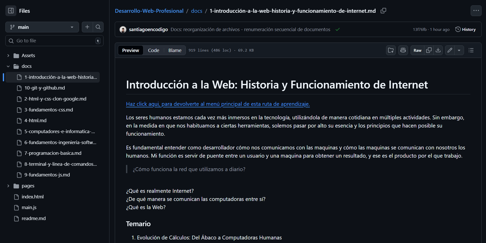
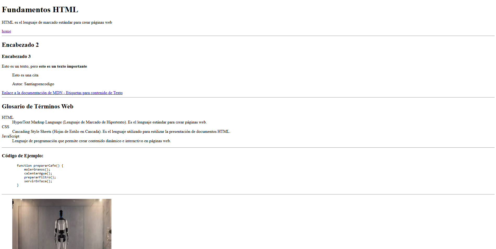
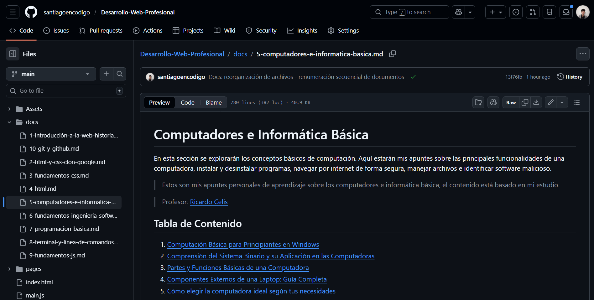
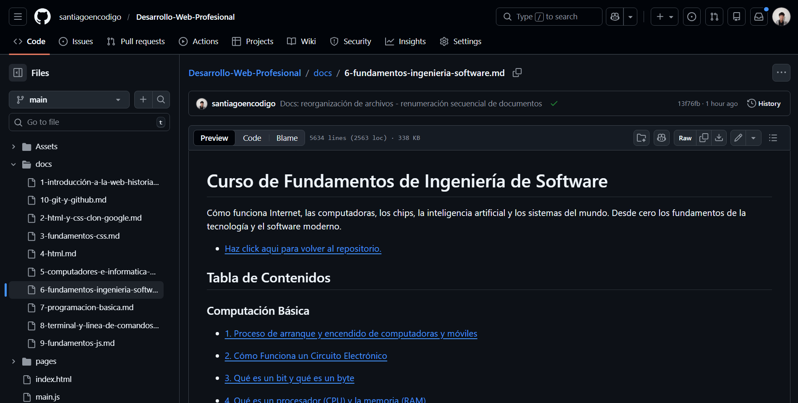

<h1 id="main-title">Fundamentos del Desarrollo Web Profesional</h1>

* <a href="https://santiagoencodigo.github.io/Desarrollo-Web-Profesional/" target="_blank">Haz click aqui para ingresar al MAIN page de este repositorio.</a>

Bienvenido a este repositorio, un espacio dedicado a documentar y aplicar mis aprendizajes en el camino hacia el desarrollo web profesional.

Aquí encontrarás resúmenes, apuntes y prácticas de cursos fundamentales que abarcan desde los conceptos básicos de informática y el funcionamiento de Internet, hasta el uso de herramientas esenciales como Terminal, Git y GitHub, y tecnologías clave para la web: HTML, CSS y JavaScript.

Este repositorio tiene como propósito:

+ Consolidar mis conocimientos en desarrollo web.

+ Documentar conceptos y ejemplos prácticos.

+ Crear una base sólida para proyectos más avanzados.

>Por ultimo, una recomendación personal para retener más toda esta información. Por cada concepto que se encuentre aqui se debe pensar en ¿Cómo se aplica esto en un proyecto real? Plantearse este tipo de preguntas refuerza la retención.

---

# Los contenidos que se desarrollan aquí están organizados en torno a los siguientes temas:

## Historia y funcionamiento de Internet.

[Documentación](https://github.com/santiagoencodigo/Desarrollo-Web-Profesional/blob/main/docs/1-introducci%C3%B3n-a-la-web-historia-y-funcionamiento-de-internet.md "Documento Historia y funcionamiento de Internet.")

En este apartado encontrarás apuntes estructurados sobre el funcionamiento de los computadores y la red. Se abordan conceptos fundamentales como bits, bytes, código máquina, códigos ASCII, colores RGB y Unicode, así como los orígenes de ARPANET, el funcionamiento de Internet, los principales protocolos (HTTP, HTTPS), la evolución de los navegadores, el papel del W3C, el funcionamiento de la World Wide Web y muchos otros temas relacionados.

---

## HTML y CSS práctico (Clon de Google):

* [Documentación](https://github.com/santiagoencodigo/Desarrollo-Web-Profesional/blob/main/docs/2-html-y-css-clon-google.md "Apuntes HTML y CSS by Santiagoencodigo")   

* [Proyecto](https://santiagoencodigo.github.io/Desarrollo-Web-Profesional/pages/01-html-y-css-google-clone/index.html "Proyecto HTML y CSS by Santiagoencodigo")

En esta sección se desarrolla un clon [de la página principal de Google](https://www.google.com "Page Google") empleando únicamente HTML5 y CSS3. El objetivo principal es afianzar los fundamentos de estructuración semántica con HTML y estilización con CSS, aplicando técnicas modernas de maquetación como Flexbox y Grid.

### Objetivos de aprendizaje

* Comprender cómo estructurar un sitio web desde cero, usando etiquetas semánticas de HTML.

* Aplicar reglas de CSS para dar estilo y posición a los elementos.

* Usar metodologías de organización como BEM para nombrar clases y mantener un código escalable.

* Practicar con herramientas de desarrollo (DevTools) para depuración y ajustes en tiempo real.

* Diferenciar cuándo aplicar Flexbox y cuándo Grid según las necesidades de maquetación.

---

## Fundamentos CSS

* [Documentación](https://github.com/santiagoencodigo/Desarrollo-Web-Profesional/blob/main/docs/3-fundamentos-css.md "Documentación CSS by Santiagoencodigo")

* [Proyecto](https://santiagoencodigo.github.io/Desarrollo-Web-Profesional/pages/02-fundamentos-css/index.html "Proyecto Portafolio CSS by Santiagoencodigo")

En este apartado se encuentra cómo aplicar estilos, tipografía y colores para mejorar la legibilidad y estética de una página web. Además, conoceré el uso de layouts modernos, responsive design, efectos visuales y animaciones, desarrollando una base sólida para crear interfaces atractivas, funcionales y adaptables a cualquier dispositivo.

---

## HyperText Markup Language | HTML 

* [Documentación](https://github.com/santiagoencodigo/Desarrollo-Web-Profesional/blob/main/docs/4-html.md "Documentación HTML by Santiagoencodigo")

* [Proyecto](https://santiagoencodigo.github.io/Desarrollo-Web-Profesional/pages/03-html/index.html "Proyecto HTML by Santiagoencodigo")

En esta sección se puede ver mis apuntes sobre cómo escribir código limpio, semántico y estructurado, comprendiendo la base sobre la que se construyen todas las páginas web. Explorando el rol de HTML en la web moderna y cómo su correcta organización afecta directamente en la accesibilidad, el SEO, y la mantenibilidad de un sitio web.

---

## Computadores e informática básica.

* [Documentación](https://github.com/santiagoencodigo/Desarrollo-Web-Profesional/blob/main/docs/5-computadores-e-informatica-basica.md "Documentación Computadores e Informática básica - REPO by Santiagoencodigo")

En esta sección se explorarán los conceptos básicos de computación. Aquí estarán mis apuntes sobre las principales funcionalidades de una computadora, instalar y desinstalar programas, navegar por internet de forma segura, manejar archivos e identificar software malicioso.

---

## Fundamentos de ingeniería de software.

* [Documentación](https://github.com/santiagoencodigo/Desarrollo-Web-Profesional/blob/main/docs/6-fundamentos-ingenieria-software.md "Apuntes Fundamentos Ingeniería de Software by Santiagoencodigo")

Aquí encontrarás apuntes sobre los fundamentos de la ingeniería de software. Incluye temas como bits y bytes, el funcionamiento de internet, las computadoras, los chips, la inteligencia artificial y los sistemas del mundo.

---

## Programación básica.

* [Proyecto](https://santiagoencodigo.github.io/Desarrollo-Web-Profesional/Pages/01.%20Programacion%20Basica/mokepon.html "Page Mokepon")

> En proceso

---

## Terminal y línea de comandos.

* <a src="https://github.com/santiagoencodigo/Desarrollo-Web-Profesional/blob/main/Docs/7-Terminal-y-linea-de-comandos.md">Documentación</a> 

En esta sección se encuentra cómo utilizar la terminal y la línea de comandos (Terminal BASH) para navegar el sistema operativo, manipular archivos y directorios, comprender permisos y procesos, y usar herramientas como grep y curl. Integra alias y personaliza tu shell para optimizar el flujo de trabajo.

> En proceso

---

## Fundamentos de JavaScript.

* <a src="">Documentación</a> 

* <a src="">Proyecto</a>

En este apartado se encuentran las bases de JavaScript: variables, tipos de datos, estructuras condicionales, loops, arrays, funciones, objetos, promesas, asincronía y programación orientada a objetos en proyectos prácticos.

> Pendiente

---

## Control de versiones con Git y GitHub.

* <a src="">Documentación</a> 

> Pendiente

---

Este repositorio es parte de mi proceso de aprendizaje continuo, con la visión de construir proyectos reales que aporten valor y fortalezcan mis habilidades como desarrollador.